# 2026 SOA Case Study: The Pricing Frontier
Team: 4001 Crusaders

Members: Niklesh Anantha-Siva, Armaan Banga, Toby Mufford, Huy Pham, Vatsal Sharma

## Project Summary

The 4001 Crusaders actuarial team at Galaxy General Insurance Company (GGIC) have been given the opportunity to develop an insurance portfolio for Cosmic Quarry Mining Corporation (CQMC). The proposed insurance products account for the risks associated with CQMC's operations which are reflected in each of the hazards covered:

| Hazard | Annual Premium | Expected Loss | Loss Ratio | Net Revenue |
|---|---|---|---|---|
| Equipment Failure | Đ44.61M | Đ26.73M | 59.99% | Đ15.88M |
| Cargo Loss | Đ660.07M | Đ519.60M | 78.72% | Đ107.46M |
| Workers' Compensation | Đ17.01M | Đ8.82M | 51.80% | Đ3.26M |
| Business Interruption | Đ206.25M | Đ160.88M | 78.00% | Đ46.37M |

The following page will navigate each of the 4 hazards separately, exploring how the unique risks and challenges associated with each of them influenced our modelling choices and premium calculation. 

## Cargo Loss
### Data Exploration
Cargo loss presents an extremely challenging and risky hazard from both a frequency and severity perspective. Historical shipment claims reveal that 18.23% of shipments resulted in at least 1 claim with claim counts ranging up to 5 per shipment. This is coupled with the high claim severity, with the average and median claim loss being Đ7.8M and Đ382k respectively. The histogram of claim size severity also illustrates how it has a highly skewed bimodal distribution. 

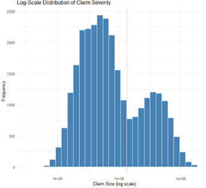

The most notable covariate influencing claim severity size was cargo type, with gold and platinum cargo shipments specifically having a disproportionate impact on the higher claim sizes relative to other cargo types. The plot below reveals the average claim size of gold and platinum shipments were Đ10M and Đ43M respectively, much larger than the remaining cargo types whose average is less than Đ1M. A further analysis into the tail risk reveals that 88.5% of the 5% largest claims were gold cargo shipments despite all cargo types having an equal distribution. Platinum was the other cargo type making up the remaining 11.4%.

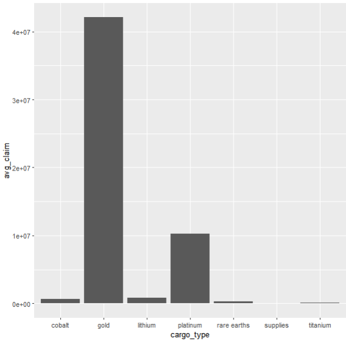

### Product Offering

In light of these discoveries, our modelling and subsequent product design were carefully selected to control these tail risks and uncertainties.
Our coverage benefit structure thus incorporated a Đ100k deductible to prevent attritional claims from inflating premiums. The policy limit was set at Đ1M per shipment to truncate the maximum payout, reducing the impact of very extreme losses. This still provides substantial coverage with 75% of the predicted claims falling within this limit. Without these strict controls, the severity profile appears too extreme for an affordable and sustainable product.
Exclusions included
*Cargo shipments carrying gold are excluded from cover. This was necessary given the unavailability of the gold extraction forecast plans which created too much pricing uncertainty given its disproportionately higher claim size
*Platinum is covered up to a 50,000kg weight cap given its strong association with higher claim severity but to a much lesser extent than gold 
*Each insured vessel is subject to a maximum number of insured shipments by system. Helionis system vessels can be insured for their first 4 shipments, Bayesia vessels for their first 3, and Oryn Delta vessels for their first 2. This controlled the size of the portfolio whilst still meeting the volume needs of cosmic mining corporations expansionary mining plans 
*Cargo shipments exceeding the recommended maximum cargo weight are excluded  


### Modelling
The modelling procedure involved first utilising a GLM model to predict claim severity and frequency. Frequency was modelled using a poison distributed log-link GLM keeping only significant variables at a 5% significance level. Regarding the severity model, it was realised that a singular GLM model would fail to capture the bimodal distribution that we observed. Thus, a 2 layered GLM model was chosen consisting of 3 GLM models. The first was a classifier GLM model which predicted whether a covariate profile would result in a big or small claim. Đ1.8M was the threshold chosen to split the claim sizes based on the previously observed graph to effectively split the claim size distribution into unimodal distributions. Then, 2 separate GLM’s trained on small and large claim sizes respectively were used to predict claim severity. Based on a train-test split which split 80% of the data into a training dataset and 20% into a testing, it was revealed that this 2 layered GLM approach was superior, seeing an MSE reduction of 650k relative to a single GLM model.

```r
cargo_freq_model<-glm(claim_count~cargo_type+route_risk+pilot_experience+container_type,data=table_cargo_freq,offset=log(exposure),family=poisson(link="log"))

cargo_classifier_model<-glm(claim_relativity~cargo_type+weight+route_risk+solar_radiation,data=table_cargo_sev,family=binomial)

table_cargo_sev_small<-table_cargo_sev %>%
  filter(claim_relativity==0)

table_cargo_sev_large<-table_cargo_sev %>%
  filter(claim_relativity==1)


cargo_sev_small_model<-glm(claim_amount~cargo_type+weight+route_risk+solar_radiation+debris_density,data=table_cargo_sev_small,family=Gamma(link="log"))
sev_dispersion_small<-summary(cargo_sev_small_model)$dispersion

cargo_sev_large_model<-glm(claim_amount~cargo_type+route_risk+solar_radiation,data=table_cargo_sev_large,family=Gamma(link="log"))
sev_dispersion_large<-summary(cargo_sev_large_model)$dispersion
```


Once the GLM models were built, 10000 Monte-Carlo simulations were used to estimate the portfolio claim size. Firstly a synthetic shipment portfolio dataset utilising the limited fleet dataset we had. We modelled the number of shipments as a binomial random variable with parameters chosen to be in line with the maximum number of shipments allowed by the policy and the expected shipments to be equal to the number of shipments needed in each solar system to meet the CQMC long-term mining production goals. Covariate based data was sampled from the historical dataset with slight assumption changes being made based off the qualitative descriptions we had regarding solar systems attributes. For example, regarding how we sampled the route risk covariate, we utilised the baseline probabilities implied by the dataset and then increased probabilities of higher route risks for solar systems like Oryn to reflect its risk associated with fluctuating gravitational gradients.

```r
route_risk_draw<-function(solar_system, length){
  if(solar_system=="Helionis Cluster") {
    return(sample(c(1,2,3,4,5),length, replace=TRUE, prob=c(0.10-0.05,0.2-0.05,0.4-0.1,0.2+0.1,0.1+0.1)))}
  if(solar_system=="Bayesia") {
    return(sample(c(1,2,3,4,5),length, replace=TRUE, prob=c(0.1+0.1,0.2+0.05,0.4,0.2-0.1,0.1-0.05)))}
  if(solar_system=="Oryn Delta") {
    return(sample(c(1,2,3,4,5),length, replace=TRUE, prob=c(0.1-0.05,0.2-0.05,0.4-0.15,0.2+0.1,0.1+0.15)))}}

```


Once the shipment portfolio was created, simulations were run utilising the poison and gamma distribution implied by our frequency and severity GLM modelling. This allowed claims to follow a distribution based on their covariate compositions as opposed to fitting a gamma distribution on the overall claim severity profile which would fail to differentiate the covariate risk.

```r
n_sim <- 10000
n_rows <- nrow(practice_data_freq_helionis)
simulated_total_short_helionis <- numeric(n_sim)

simulated_total_short_helionis_deepspace <- numeric(n_sim)
simulated_total_short_helionis_dockarc <- numeric(n_sim)
simulated_total_short_helionis_hardseal <- numeric(n_sim)
simulated_total_short_helionis_longhaul <- numeric(n_sim)
simulated_total_short_helionis_quantumcrate <- numeric(n_sim)

for (k in seq_len(n_sim)) {
  number_claims <- rpois(n_rows, practice_data_freq_helionis$lambda)
  idx <- which(number_claims > 0)
  if (length(idx) > 0) {
    shapes <- rep(practice_data_freq_helionis$shape[idx], number_claims[idx])
    scales <- rep(practice_data_freq_helionis$scale[idx], number_claims[idx])
    container <- rep(practice_data_freq_helionis$container_type[idx], number_claims[idx])
    claim_size <- rgamma(length(shapes), shape = shapes, scale = scales)
    claim_size_limit <- pmax(0, pmin(claim_size, 1e6) - 1e5)   
    simulated_total_short_helionis[k] <- sum(claim_size_limit)
    simulated_total_short_helionis_deepspace[k] <-
      sum(claim_size_limit[container == "DeepSpace Haulbox"])
    simulated_total_short_helionis_dockarc[k] <-
      sum(claim_size_limit[container == "DockArc Freight Case"])
    simulated_total_short_helionis_hardseal[k] <-
      sum(claim_size_limit[container == "HardSeal Transit Crate"])
    simulated_total_short_helionis_longhaul[k] <-
      sum(claim_size_limit[container == "LongHaul Vault Canister"])
    simulated_total_short_helionis_quantumcrate[k] <-
      sum(claim_size_limit[container == "QuantumCrate Module"])
  }
}

```
### Premium
Our premium derivation started by calculating the pure premium which was the expected loss in our simulation which was then adjusted using buhlmann credibility which blended the portfolio experience with container type level data to stabilise our premium estimates. We also added stress loading and volatility loading factors to ensure our premium reflects uncertainty and risk associated with our simulations and assumptions. Cost of capital on our reserves and operational expense were further added on, leading to our final premium of Đ660M for coverage across all 3 solar systems which on average produced a Đ107M return.

| Metric | Helionis | Bayesia | Oryn | Total |
|---|---:|---:|---:|---:|
| Vessels insured | 1,160 | 1,128 | 774 | 3,062 |
| Pure premium | Đ286,026,916 | Đ152,013,507 | Đ81,563,628 | Đ519,604,051 |
| Buhlmann credibility premium | Đ283,213,208 | Đ150,635,565 | Đ80,125,874 | Đ513,974,647 |
| Stress loading | Đ309,720,579 | Đ174,939,198 | Đ91,074,367 | Đ575,734,144 |
| PV discounting of claims | Đ307,504,089 | Đ173,687,260 | Đ90,422,601 | Đ571,613,950 |
| Volatility loading | Đ329,054,526 | Đ189,506,772 | Đ101,908,464 | Đ620,469,762 |
| Cost of capital | Đ332,004,766 | Đ191,612,802 | Đ103,445,634 | Đ627,063,202 |
| Operational expenses | Đ349,478,701 | Đ201,697,686 | Đ108,890,141 | Đ660,066,528 |
| Final premium | Đ349,478,701 | Đ201,697,686 | Đ108,890,141 | Đ660,066,528 |
| Premium per vessel | Đ301,275 | Đ178,810 | Đ140,685 | Đ215,567 |
| Loss ratio | 81.8% | 75.4% | 74.9% | 78.7% |

## Business Interruption
### Data Exploration
Business Interruption (BI) presents a low-frequency, high-severity risk profile, characterised by significant tail-risk despite a high volume of non-claims.  Claim frequency is defined by a significant zero-inflation with mean of 0.10 against a variance of 0.17, where the massive peak at zero renders standard Poisson distributions inadequate and necessitates either a hurdle model or zero-inflated model approach. On the severity side, the average claim amount is approximately $1,174,300; the distribution is heavily negatively skewed with a pronounced peak at the upper policy threshold.
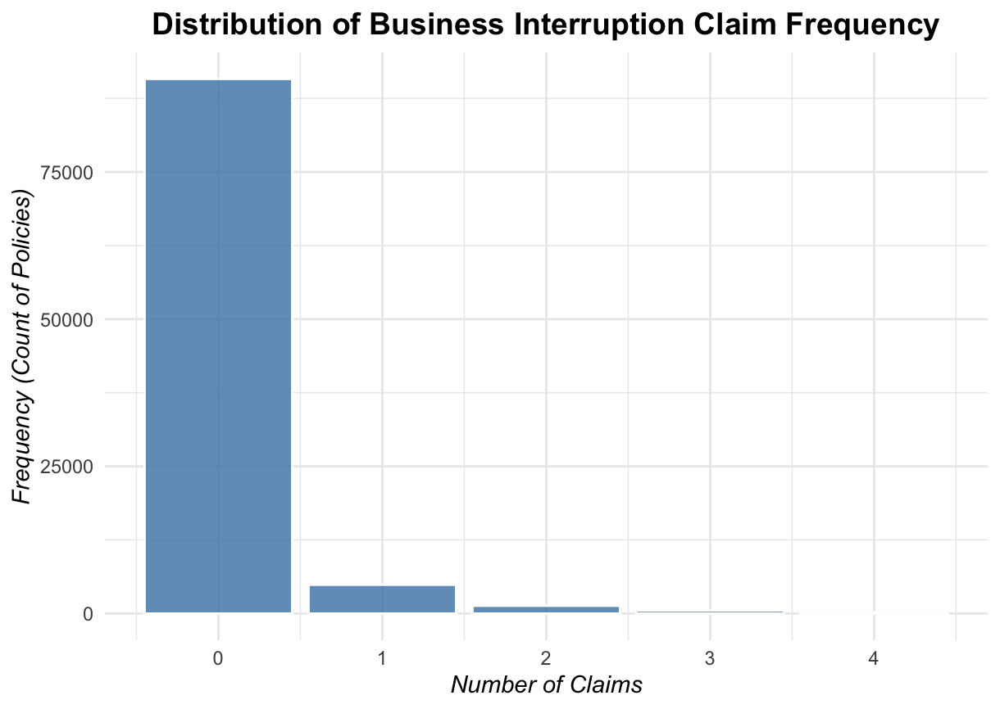
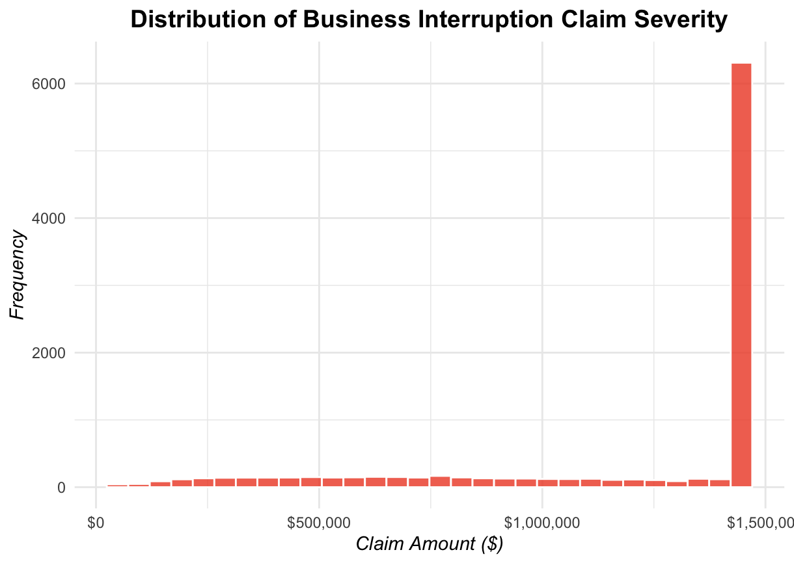
The most significant operational drivers appear to be the energy backup score, supply chain index, and maintenance frequency consistently emerge as significant predictors across initial modelling testing, indicating that these variables are the primary levers for managing risk volatility. A comparative segment analysis reveals a distinction in risk exposure between the analysed regions. Epsilon and Zeta exhibit nearly identical frequency and severity profiles, whereas the Helionis Cluster (HC) serves as a low-risk outlier, recording roughly 50% the total claim volume and frequency of its counterparts. This favourable performance in HC is correlated with superior operational efficiency, including the highest energy system efficiency, unit sourcing proportions, and compliance scores, even though it reports lower crew experience and maintenance turnover. While the overall company operating margin remains resilient at 31%, the data suggests that while HC benefits from lower exposure levels, the lack of a clear severity pattern across systems implies that extreme loss events remain a latent threat.

### Product Offering
Considering the highly skewed, "all-or-nothing" loss behaviour, the BI product is designed to strictly control tail risk and pricing uncertainty. Our benefit structure incorporates a Đ28,000 deductible to ensure that minor operational disruptions are retained by CQMC, preventing low impact "noise" from inflating the risk premium. The policy limit is set at Đ1,426,000 to truncate exposure to the extreme severity events that cluster at the upper threshold of the distribution. Without these rigorous controls, the underlying claims profile is too volatile to support an affordable or sustainable indemnity product.
To further stabilise the portfolio, coverage is restricted to high-certainty triggers such as core system failures within mandated maintenance windows or documented interruptions in the Quantum-secured supply chain. Specific exclusions were necessary to mitigate moral hazard; as such, losses resulting from neglected infrastructure or maintenance falling below required benchmarks are excluded from cover. Furthermore, legal and environmental penalties from the Interstellar Court of Environmental Justice are excluded to ensure the product remains focused on operational system failures rather than regulatory liabilities. This focused framework allows GGIC to offer essential coverage while remaining protected against the most extreme loss outcomes.

### Modelling
Naive Poisson was firstly utilised for frequency modelling to explore significant covariates, however as overdispersion is realised, we selected a Zero-Inflated Negative Binomial (ZINB) frequency model with a constant zero-inflation parameter, which demonstrated superior performance in capturing the portfolio's unique risk profile. This modeling choice reflects the observation that approximately 88% of the portfolio resides in a "structural zero" state, a universal behaviour likely driven by the autonomous extraction fleets and self-healing hulls utilised across all systems. ZINB also yields lower AIC, BIC and higher likelihood than Zero-Inflated Poisson or Negative Binomial alone, whereas these statistics would be less favourable if covariates are used for the zero-inflated hurdles rather than a constant.

```r
library(glmmTMB)
# Fitting ZINB with constant zero-inflation (ziformula = ~ 1)
zinb_model_basic <- glmmTMB(
  claim_count ~ solar_system + production_load + energy_backup_score + 
    supply_chain_index + avg_crew_exp + maintenance_freq + 
    safety_compliance + offset(log(exposure)),
  ziformula = ~ 1,      
  data = filtered.bus.interupt.freq,
  family = nbinom1 # nbinom1 was selected over nbinom2 based on AIC/BIC
)
summary(zinb_model_basic)
```


For severity modelling, we employed a Gamma GLM with a log-link function, which is ideally suited for continuous, positive-valued insurance data. Although the raw data exhibits heavy negative skewness due to the Đ1,426,000 policy limit "clumping" the results, the Gamma distribution (shape parameter 1.41, scale parameter 1,085,000) provides a mathematically robust framework for capturing the underlying attritional loss behaviour. To ensure the model accurately reflects the actual risk transfer, the data was strictly bounded between the Đ28,000 deductible and the Đ1,426,000 policy limit prior to fitting. The resulting dispersion parameter (0.708) was critical in parameterising our Monte Carlo simulation, allowing us to account for the variance nature of BI events while ensuring that projected costs remain sensitive to exposure and safety compliance levels across Epsilon, Zeta, and the HC.

```r
# Pre-processing: Bounding claims by deductible and policy limit
filtered.bus.interupt.sev <- bus.interupt.sev %>%
  mutate(claim_amount = pmax(28000, pmin(claim_amount, 1426000))) %>%
  filter(claim_amount > 0)

# Fitting Gamma GLM for Severity
sev_model <- glm(claim_amount ~ solar_system + production_load + 
                   energy_backup_score + safety_compliance + offset(log(exposure)), 
                 data = filtered.bus.interupt.sev, 
                 family = Gamma(link = "log"))

avg_severity <- mean(predict(sev_model, type = "response"))
```

To project financial outcomes, we conducted a Monte-Carlo simulation with 20,000 iterations, pairing the ZINB frequency with a Gamma severity distribution (shape 1.41, scale 1,085,000), with all simulated individual claims strictly bounded between the Đ28,000 deductible and the Đ1,426,000 policy limit.

```r
set.seed(42) 
n_sims <- 20000
portfolio_losses <- numeric(n_sims)
gamma_dispersion <- 0.708287 

for (i in 1:n_sims) {
  # 1. Simulate frequency from ZINB
  sim_counts <- simulate(zinb_model_basic, nsim = 1)$sim_1
  total_claims <- sum(sim_counts)
  
  # 2. Simulate severity from Gamma
  if (total_claims > 0) {
    shape_param <- 1 / gamma_dispersion
    scale_param <- avg_severity * gamma_dispersion
    
    # Generate costs and sum for aggregate loss
    individual_costs <- rgamma(n = total_claims, shape = shape_param, scale = scale_param)
    portfolio_losses[i] <- sum(individual_costs)
  } else {
    portfolio_losses[i] <- 0
  }
}

# Extracting key metrics
expected_agg_loss <- mean(portfolio_losses)
var_99 <- quantile(portfolio_losses, 0.99)
```

### Premium
Our financial projections, developed using the Buhlmann framework with a 22% commercial loading, highlight a significant "limit censoring" effect within the portfolio. Notably, the simulated premium for a "Catastrophic" system characterised by maximum claim amounts, was found to be slightly lower than that of an "Average" system. This paradox occurs because our policy limit effectively caps the maximum payout for extreme events, whereas systems with average frequency and severity can generate multiple smaller claims that, when aggregated, represent a higher theoretical total loss to the model. This pricing structure ensures the product remains resilient against single-event volatility while accurately reflecting the cumulative risk inherent in high-frequency operational disruptions.

| Per-Unit Premium Scenarios (Projected) | Value (Đ) |
| :--- | ---: |
| **Safe System (Zero Claims)** | Đ16.28 |
| **Average System** | Đ20.14 |
| **Catastrophic System (Limit Hit)** | Đ19.81 |

| Metric | Helionis | Bayesia | Oryn | Total |
| :--- | ---: | ---: | ---: | ---: |
| Mining units (Active) | 30 | 15 | 10 | 55 |
| Pure premium | Đ87,752,727 | Đ43,876,364 | Đ29,250,909 | Đ160,880,000 |
| Buhlmann credibility premium | Đ86,875,100 | Đ44,312,400 | Đ30,412,500 | Đ161,600,000 |
| Stress loading | Đ97,295,312 | Đ49,635,112 | Đ34,061,576 | Đ180,992,000 |
| PV discounting of claims | Đ95,349,405 | Đ48,642,410 | Đ33,380,335 | Đ177,372,150 |
| Volatility loading | Đ102,015,120 | Đ52,056,230 | Đ35,721,550 | Đ189,792,900 |
| Cost of capital | Đ105,320,115 | Đ54,142,320 | Đ36,482,065 | Đ195,944,500 |
| Operational expenses | Đ5,537,288 | Đ2,811,284 | Đ1,961,428 | Đ10,310,000 |
| Final premium | Đ110,857,403 | Đ56,953,604 | Đ38,443,493 | Đ206,254,500 |
| Premium per unit | Đ3,695,247 | Đ3,796,907 | Đ3,844,349 | Đ3,750,082 |
| Loss ratio | 79.2% | 77.1% | 76.1% | 78.0% |

## Equipment Failure

### Data Exploration

Analysis of the equipment failure hazard reveals various risks that CQMC will have face with their mining operations. Across all three solar systems, CQMC have a total of 4,730 assets which are prone to environmental degradation and or unforeseen damage. Based on historical data, systems similar to Oryn Delta present the highest risk, with an average risk index of 0.62 and heavy tail losses as indicated by a Kurtosis of 404 and skewness of 16.3. The Helionis Cluster and Bayesian System are both significantly less risky as seen through the risks index of 0.49 and 0.53 respectively. 

<p align="center">
  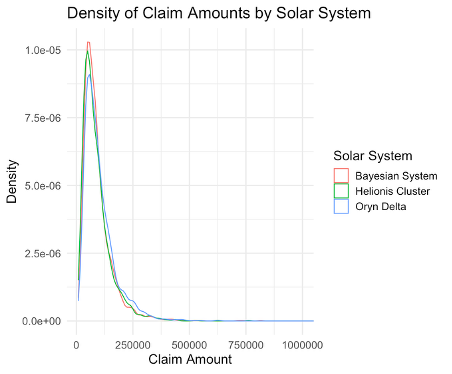
  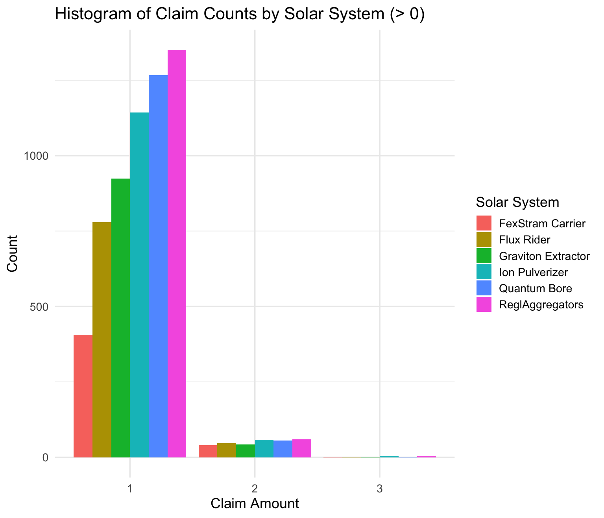
</p>

As for the risk derived from equipment types, Quantum Bores have the highest risk with an average risk index of 0.8. The 99% expected shortfall of Đ495,958.70 further illustrates the severity of losses related to this equipment type. Due to the nature of equipment failure, taking on insurance for high-risk incidents only if the equipment is well-maintained will be an ideal consideration CQMC.

<p align="center">
  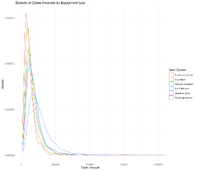
  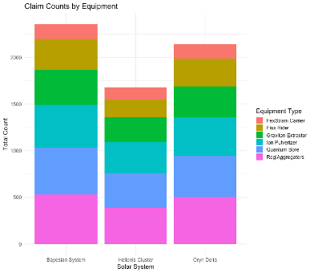
</p>

### Premium Modelling

For the pricing and capital modelling, various models were applied in order to effectively represent the risks associated with equipment failure. For the premium pricing, a LASSO GLM was utilised for the severity under a gamma distribution and a Poisson model for the frequency. 

```r
## Severity Model
sev_lasso <- cv.glmnet(X_sev_train, sev_train$claim_amount, 
                       family = Gamma(link = "log"), 
                       alpha = 1)

## Frequency Model
freq_lasso <- cv.glmnet(X_freq_train, freq_train$claim_count, family = "poisson", 
                        offset = log(freq_train$exposure), alpha = 1)
```

Given the high risk associated with equipment failure, it would be ideal to protect high risk equipment, hence a deductible was applied to each solar system to reduce the effect on capital by attritional claims. Furthermore, since there was no given data for the Oryn Delta and Bayesian System, Bühlmann credibility weighting was utilised to account for the approximation. After training the GLM, they were tested on an unseen subset of the data to generate pure premiums which were equivalent to the expected loss for each claim. With this, premiums were averaged by solar system and loadings were applied to obtain a gross premium. The loadings include a 5% profit load for which 2% goes towards an environmental loading and a 7% variable expense loading. This yielded a 1-year total premium of Đ44.61M, which provides coverage for all assets, both and active and idle. The 10-year premium is Đ436.75M which accounts for inflation and discount rates.


### Capital Modelling

To determine capital requirements, a monte-carlo simulation was run to estimate the yearly expected losses for each solar system. In order to achieve this, maximum likelihood estimation (MLE) was utilised to determine the theoretical distributions for severity and frequency. In all cases, the log-normal and negative binomial distributions were the best fit for each solar system. Then, 100,000 iterations of the loop were run in which there was a 1% chance of an intergalactic shock event which would increase claim severity by 5 times. Ultimately, the 99% expected shortfall is Đ129.1M and the 10-year capital is Đ420.9M. To understand the assumptions in regard to the parameters, sensitivity analysis was conducted where each variable in the simulation was adjusted to understand how capital requirements may change. From this it became evident that the impact of the joint shock factor is extremely sensitive and could be a point for revision with future data.

<p align="center">
  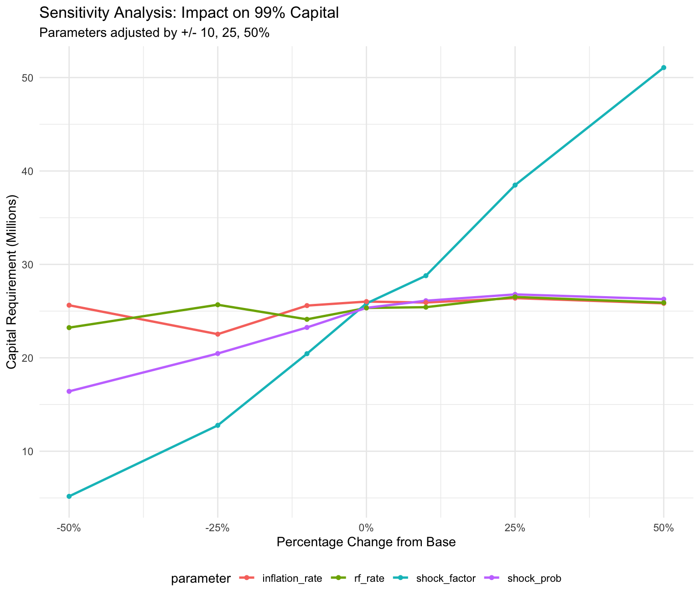
  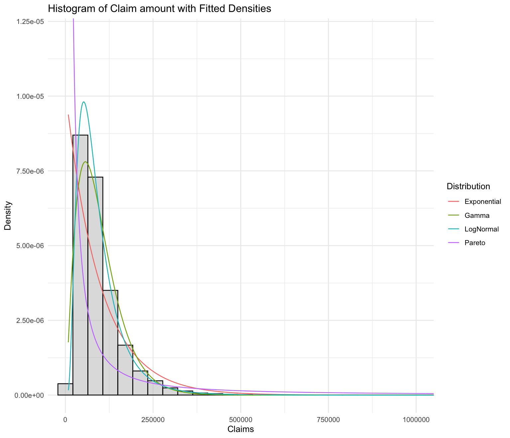
</p>

### Workers' Compensation
Data Exploration
CQMC operates 55 active mines across three solar systems, with a total workforce of 35,809 employees distributed proportionally by mine count: Helionis Cluster (30 mines, 19,532 workers), Bayesia System (15 mines, 9,766 workers), and Oryn Delta (10 mines, 6,509 workers). The workers' compensation claims database contains 133,398 worker-period records and 1,913 paid claims across three historical proxy systems, representing 67,875 worker-years of exposure.

Claim frequency varies significantly by occupation class. Drill Operators have the highest claim rate at 4.75 per 100 worker-years, 69% above the fleet average of 2.81, reflecting sustained exposure to heavy machinery. Administrators sit at the opposite end at 1.54 per 100 worker-years. Maintenance Staff, the largest occupation class at 34.3% of the workforce records 3.17 per 100 worker-years, meaning this group drives a disproportionate share of aggregate claims through scale alone.

<p align="center">
  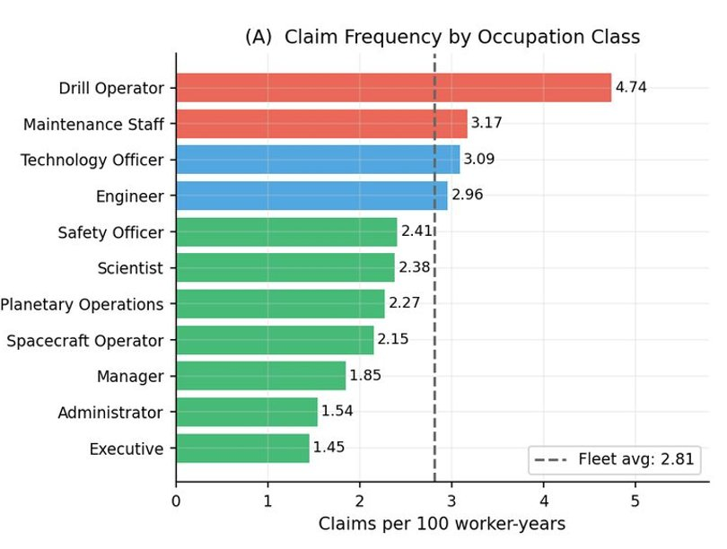
</p>


Claim severity is highly right-skewed across all systems, with the fleet mean of Đ7,823 being 3.2× the median of Đ2,054, and the largest single claim reaching Đ193,357. The Lognormal distribution was selected over Gamma for severity modelling at all three systems on the basis of AIC margins of 218, 431, and 467 points respectively, as it better captures the extended right tail.

<p align="center">
  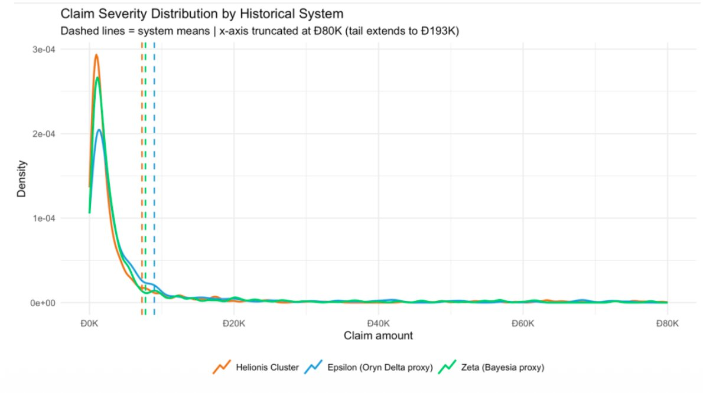
</p>

Four worker characteristics show statistically significant relationships with claim frequency: workers with 20+ years of experience produce 43% fewer claims; a one-point improvement in safety training score reduces frequency by ~31%; a one-point increase in psychosocial stress score raises frequency by ~37%; and workers with a prior accident record generate 28% more claims.

Product Offering
GGIC recommends a single master policy with three system-specific endorsements reflecting the distinct operating environments. Key benefit structures are summarised below:

| Feature | Helionis Cluster | Bayesia System | Oryn Delta |
| :--- | :--- | :--- | :--- |
| **Waiting period** | 7 days | None | None |
| **Phase 1 indemnity** | 100% salary, days 1-7 | 100% salary, days 0-30 | 100% salary, days 0-14 |
| **Phase 2 indemnity** | 80% salary, days 8-90 | 85% salary, days 31-180 | 85% salary, days 15-90 |
| **Phase 3 indemnity** | 60% salary, days 91+ | 70% salary, days 181+ | 65% salary, days 91+ |
| **Permanent disability** | Max(5× salary, Đ250K) | Max(5× salary, Đ250K) | Max(5× salary, Đ250K) |
| **Special benefit** | — | Radiation illness: 3× salary | Asteroid ring hazard: 3× salary |

The Đ250,000 permanent disability floor ensures every worker receives a meaningful minimum payout regardless of pay grade, correcting a structural inequity in salary-linked formulas. No waiting period applies in Bayesia and Oryn Delta given structural communication delays which would routinely deny legitimate claims that simply cannot be initiated on time.
Standard exclusions across all systems include off-duty injuries, deliberate PPE non-compliance, pre-existing conditions not materially aggravated by work, and claims not reported within 180 days (Oryn Delta: clock starts from communications restoration).


Modelling
The gross pure premium per worker is built from a base pure premium multiplied by six sequential loadings: a trend factor of 1.2302 (4.23% p.a. compounded over 5 years), a 1.12 IBNR reserve to capture long-tail reporting delays, a 1.6667 commercial loading targeting a 60% loss ratio, a 1.05 catastrophe provision as a frontier surcharge, an investment income offset (10% nominal return on reserves), and a schedule modification factor that adjusts for CQMC's specific workforce risk profile relative to the historical pool using GLM coefficients for experience, stress, training quality, and accident history.
Bühlmann credibility was applied across occupation classes to blend class-specific observed rates with the fleet-wide prior. The credibility parameter k = 254.2 worker-years, meaning a class with exactly 254 worker-years of exposure receives equal weight from its own data and the fleet prior.

```r
# Bühlmann credibility blending
PP_class <- Z * PP_observed + (1 - Z) * PP_fleet
# where Z = E / (E + k), k = EPV / VHM = 254.2 worker-years

# Capital modelling: 50,000 Monte Carlo iterations per system
N <- rpois(1, lambda_weighted)       # claim count from occupation-weighted
X <- rlnorm(N, mu_adj, sigma)        # severity from adjusted LogNormal
S <- sum(X)                          # aggregate annual loss per iteration
```
Capital was modelled via 50,000 Monte Carlo iterations per system, drawing claim counts from an occupation-weighted Poisson and severities from a LogNormal adjusted for environment, trend, and IBNR. The coefficient of variation rises from Helionis (0.104) to Bayesia (0.124) to Oryn Delta (0.161), reflecting decreasing data richness as we move from the most to least established system.

Premium
The cumulative premium build-up per worker is shown in the chart below. The gap between Helionis (Đ388/worker) and Bayesia (Đ586/worker) opens primarily at the environment and schedule modification stages, confirming that the differential is driven by EM radiation loadings and Bayesia's younger, more stressed workforce rather than base claim costs alone. Oryn Delta's final premium of Đ570/worker reflects its larger combined environment and schedule modification debit despite a lower base pure premium.

<p align="center">
  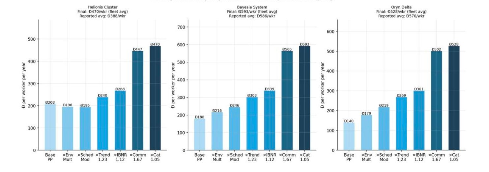
</p>


| Statistic | Helionis | Bayesia | Oryn Delta | Portfolio |
| :--- | :---: | :---: | :---: | :---: |
| **Annual gross premium** | Đ7.574M | Đ5.726M | Đ3.708M | Đ17.008M |
| **Expected annual loss** | Đ4.394M | Đ2.777M | Đ1.647M | Đ8.818M |
| **Std deviation** | Đ0.455M | Đ0.345M | Đ0.265M | Đ0.786M |
| **VaR 99%** | Đ5.625M | Đ3.727M | Đ2.392M | Đ11.74M |
| **TVaR 99%** | Đ5.953M | Đ3.967M | Đ2.650M | Đ12.57M |
| **Loss ratio** | 58.0% | 48.5% | 44.4% | 51.8% |
| **Combined ratio** | 92.0% | 82.5% | 78.4% | 85.9% |

The annual gross premium across all three systems amounts to Đ17.008M, with expected net revenue of Đ2.43M (at a 5.1% risk-free rate) and Đ8.19M (at a 10% investment return assumption). All three systems maintain a positive underwriting margin even at the VaR 99% level.


